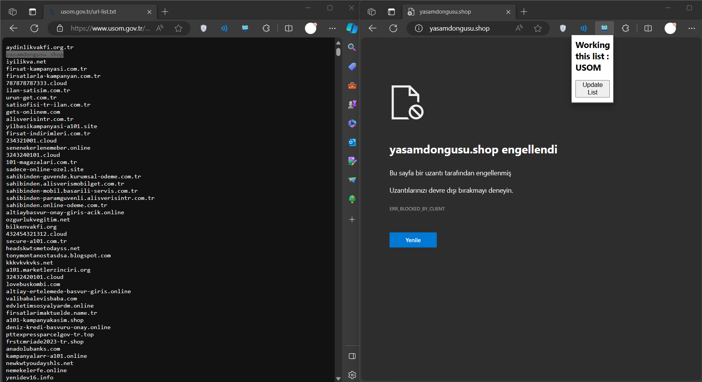

# URLSOM - Browser-based URL Blocker
### About

Your data are important to us. Thanks to this plugin, your data is now safer!
  
NO Proxy Requirement! 
NO Firewall Requirement! 
NO Web Antivirus Requirement!

Supporting List
<ul>
<li>Edge Browser</li>
<li>Chrome Browser</li>
</ul>

### Pics

### Installation
<ul>
<li><a href="chrome://extensions/">Go to extensions page (chrome://extensions/ or edge://extensions/)</a></li>
<li>Enable "Developer Mode"</li>
<li>Install "Unpacked" package and select URLSOM folder</li>
<li>Ready!</li>
</ul>

### Important
<b>In the first running, browser may freeze during loading please don't worry! Just wait.</b>
